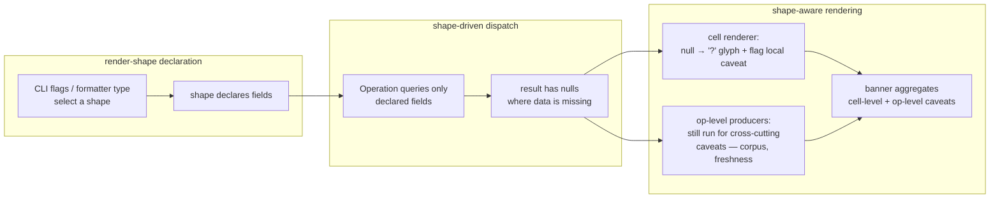
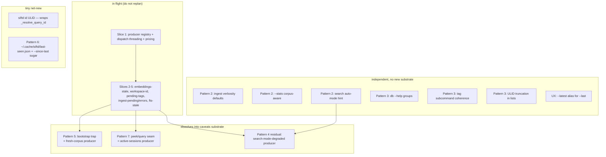
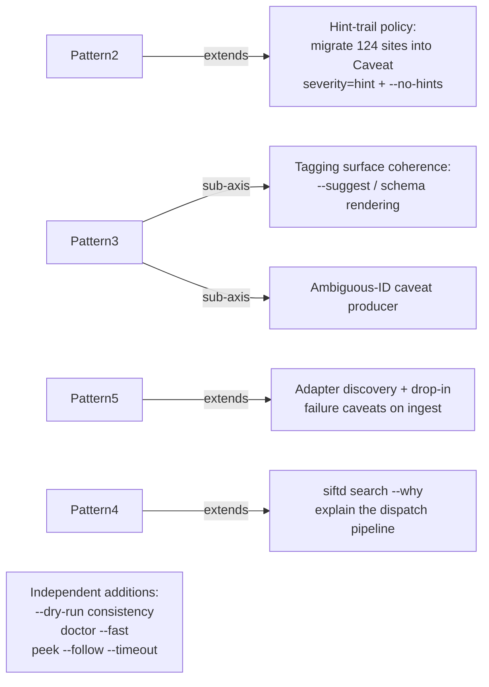

# Dogfood remediation — strategic plan (patterns 2, 3, 5, 6, 7 + UX roast)

## Context

Patterns 1 and parts of 4 are already covered by the in-flight caveats substrate
(slices 1–5: pricing, embeddings-stale, workspace-identity, pending-tags,
ingest-pending/errors, fts-stale). This plan covers the remaining patterns and
the unprefixed UX observations. The goal is a sequencing strategy and a
dissolution analysis — implementation plans come per-slice later.

The driving question for each item: **what dissolves into existing primitives,
what is genuinely net-new?** Net-new is reserved for shape that the existing
primitives can't carry without distortion.

## Architectural reframe — render-shape is the fidelity contract

**This section was added after a discussion about the pricing slice surfaced
a structural flaw in how caveats were initially being threaded.**

### The flaw observed in the in-flight pricing slice

The pricing slice as currently being implemented:

1. Adds a `missing-pricing` caveat producer.
2. Updates the `cost` cell renderer to show `?` instead of `$0.00000` —
   **but only when a fidelity flag is passed.**
3. Without the flag, the cell still shows `$0.00000`, the caveat banner
   shows separately at the top.

The problem: **the default rendering still lies.** A reader sees
`cost: $0.00000` for every row and concludes "this conversation cost
nothing" — the banner is too far away to bind to any specific cell. The
fidelity flag exists to opt *into* honesty, which is exactly backwards.

The deeper issue: **caveats were modelled as a dispatch concern**
(producer runs after the Operation, banner rides `render_context`), but
they're really a **render concern** (the cell that's lying needs to stop
lying, regardless of any flag). Bolting them on after the fact creates
the very gap the substrate was meant to close.

### The reframe

**Caveats are a property of the render contract, not the dispatch contract.**
Three layers:



Three implications:

1. **Render shape declares fields.** A formatter (or CLI flag like
   `--brief`/`--full`) chooses a shape; the shape names the columns/fields
   it will render. The Operation queries that field set, no more.
2. **Cell-level missingness is a local caveat.** A `?` glyph in a cost
   cell *is* the caveat at column granularity. No fidelity flag is
   needed — if the cell is shown, it's honest. The banner aggregates these
   into a single human-readable note.
3. **Operation-level caveats remain.** "Embeddings stale", "corpus
   has 4 conversations", "ingest hasn't run in 7 days" aren't column
   things — they're shape-level at coarser grain. Same Caveat type,
   different producer tier.

**The unifying principle:** caveats describe the *fidelity of the rendered
answer*. Some descriptions are cell-local (column nullness, formatting
loss); some are answer-wide (ranking quality, corpus context). Both flow
through the same Caveat type and the same producer registry, but
producers know which tier they belong to.

### What changes in the IR

Today: `Operation.fn(**Operation.params)` returns a result; renderer takes
what's there. `render_context` carries banner-tier caveats.

Proposed: `Operation` grows a sibling `render_shape: RenderShape` that
declares the field set. Producers see both `Operation` and `RenderShape`,
so a `missing-pricing` producer only fires when `cost` is in the shape.
The Operation's underlying query function reads the shape and selects
only those fields (or computes only those derivations — `cost` derivation
in `api/conversations.py` becomes conditional on the shape).

```python
@dataclass(frozen=True)
class RenderShape:
    fields: frozenset[str]      # {"id", "started", "model", "cost"}
    granularity: str            # "list" | "detail" | "summary"

@dataclass
class Operation:
    fn: Callable
    params: dict
    render_shape: RenderShape    # new
    render_context: dict         # existing
```

Concretely: ~1 dataclass, ~1 field on Operation, ~1 conditional in
producers (`if "cost" not in op.render_shape.fields: return []`), and
field-aware query selection in the 3-4 hot paths
(`list_conversations`, `search_chunks`, `get_tool_tag_summary`).

### What this enables that the original plan couldn't deliver cleanly

- **Cell rendering owns its own honesty contract.** `$0.00000` for missing
  cost becomes structurally impossible — every cell renderer pattern-matches
  on `None` and emits `?`. No flag, no opt-in.
- **Query cost scales with displayed information.** `--brief` doesn't
  pay for cost computation, doesn't pay for embeddings staleness checks,
  etc. Producers stop firing for fields the user isn't seeing.
- **Hint-trail migration becomes principled.** A "use --json for newline-
  delimited output" hint at `cli/data.py:342` is shape-aware: it only
  fires when the formatter is text-table, never when JSON is selected.
  The 124 printf sites map naturally onto shape predicates.
- **`--why` falls out for free.** "Why did this conversation rank low?"
  is a shape — render the explanation alongside the result. Not a special
  flag with bespoke plumbing; another shape with a different field set.
- **Backwards compatibility is local.** Today's "render everything"
  default becomes the `RenderShape.full()` constant. Changing a renderer
  to opt out of a field is a one-line shape edit, not a query rewrite.

### What it does NOT change

- The Caveat type stays (now with one optional field, see below).
- The producer registry stays.
- Existing operation-level producers (corpus context, freshness,
  embeddings-stale) keep working — they're shape-coarse but still
  shape-aware (they fire only when the shape includes a result list,
  not for `--brief`-style summary shapes).
- Wave A items remain shippable today (none of them touch caveats).
- Wave C (`--since-last`) is unaffected.

### Caveat type — one field added

```python
@dataclass
class Caveat:
    severity: Literal["error", "warn", "info", "hint"]   # +"hint"
    message: str
    fix_command: str | None = None
    field: str | None = None   # new: cell-tier caveats name their field
    channel: Literal["text", "json", "both"] = "both"
```

`field` lets cell-tier caveats bind to a column ("cost: ? in 3 of 10
rows"). `channel` lets the migration of the 124 hint sites pick "tty-only"
without going back to printf. Two optional fields. No domain types added.

### Recommended action on the in-flight pricing slice

**Pause S1 long enough to retrofit the contract**, then resume. Concretely:

1. Add `RenderShape` dataclass to `api/dispatch.py` (~20 LOC).
2. Thread it through the 3-4 query functions that need shape-aware
   selection. `cost` is the only field initially gated; the rest stay
   in the default shape until later slices peel them off.
3. Update the cost cell renderer to emit `?` for `None` *unconditionally*.
   Drop the fidelity flag.
4. Update the `missing-pricing` producer to read `op.render_shape.fields`
   and only emit when `cost` is present.
5. Add `field` and `channel` to `Caveat`.

Cost: ~half day of additional work on S1. Benefit: every subsequent slice
inherits the right contract. **Alternative (ship S1 as-is, retrofit
later)** is cheaper now but means S2-S5 each replicate the bolt-on
pattern, and the retrofit later touches every producer.

This decision wants user confirmation before S1 ships.

## Existing primitives (verified in code)

- **Operation IR** — `api/dispatch.py:21` `Operation` dataclass with
  `render_context: dict[str, Any]` already wired through `render(...)`. Anything
  computed at dispatch time can ride render_context to the formatter without
  new types.
- **Finding** — `doctor/checks/__init__.py:13`. Severity, message, fix_command,
  free-form `context: dict | None`. 20 producers in `BUILTIN_CHECKS`.
- **Caveats producer registry** (in flight) — substrate that runs producers on
  each Operation, surfaces results through render_context.
- **OutputFormat protocol** — `output/format_registry.py:25` with
  `render_detail/list/search`. Built-ins + drop-ins + entry points.
- **Stats cache** — `api/stats.py:218` `stats_cache_path()` already lives at
  `cache_dir() / "stats.json"`. Suitable storage analog for "since last time."
- **ID classifier** — `cli/query.py:185` `_resolve_query_id` already classifies
  any ULID into conversation vs event. Reusable as the kernel of `siftd id`.
- **`exclude_active`** — search.py already separates DB rows from live JSONL;
  the seam exists, it just isn't visible to the user.

## The shape



## Pattern-by-pattern dissolution

### Pattern 2 — editorial layer (ingest output, search defaults, `--stats` scope)

**Three sub-items, all dissolve.**

- **Ingest verbosity.** `cli/data.py:51` `_IngestTextRenderer` already supports
  `quiet`/`verbose`. Default for non-tty is currently the same as tty. Change
  the default for piped stdout to "summary line only" (the existing `quiet`
  branch). Net-new: zero. Risk: silent change for power users → gate behind a
  one-cycle deprecation hint.
- **`--stats` scope.** `cli/query.py:560` summarizes only the listed N
  conversations. Reuse `api/stats.py` `get_database_stats()` to compute corpus
  totals; render both ("View: 10 / 12,438 corpus | view tokens: 8.2K /
  142M corpus"). Net-new: zero — both APIs exist.
- **Search auto-mode hint.** Currently emitted via `print(...,
  file=sys.stderr)` at `cli/search.py:198`. JSON mode swallows it. **Dissolves
  into a Caveat producer** with `severity="hint"`, `channel="both"` — the
  reframed substrate carries it through both text and JSON paths. The
  producer fires when `search_mode == "fts"` due to missing embeddings and
  the rendered shape includes ranked results (i.e. not a `--count`-only
  shape). Net-new: nothing — one more producer.

### Pattern 3 — storage-think in UX (naming, organization, `$ULID`, tag incoherence)

**Mix of cheap wins and tar pits.**

- **`siftd db` is twelve commands** (`cli/db.py:733`). Reorganization is the
  tar pit — every dogfood transcript and agent prompt would break.
  **Don't rename, group help.** argparse has no native group-in-help, but
  `RawDescriptionHelpFormatter` already lets us write the `epilog` with
  categories ("Inspection", "Maintenance", "Sync", "Sync remotes"). 30-min
  edit to `cli/db.py:739` epilog. Net-new: zero.
- **Tag subcommand incoherence** (`cli/tags.py:21` `_TAG_SUBCOMMANDS`).
  `siftd tag <id> <tag>` (positional) coexists with `siftd tag list <name>`
  (subcommand). Add explicit subcommand `siftd tag apply <id> <tag>` and
  `siftd tag remove <id> <tag>`; keep current parser branches as the same
  call path so the legacy form keeps working. Net-new: ~15 LOC for two
  subparsers, zero new types.
- **Three IDs** (conversation / event / session). Already classified by
  `_resolve_query_id`. **Net-new (small):** a `siftd id <ULID>` command that
  reuses that function and prints a one-line classification with hints
  ("This is a conversation in workspace X. View: `siftd query <id>`."). Files:
  one new `cli/id_cmd.py`, ~50 LOC. No new domain types.
- **`$ULID` surface in lists.** Renderers already truncate inconsistently —
  `cli/search.py:415` uses `[:12]`, others `[:8]`, others print full. Pick a
  single short form (8 chars matches the existing peek output) and apply in
  the four list/search renderers. Net-new: zero. Risk: agents that grep for
  exact-length IDs.

### Pattern 5 — bootstrap trap as discipline

**Fully dissolves into a caveat producer.**

The producer fires when the corpus is empty or one-adapter-thin (e.g.
`SELECT COUNT(*) FROM conversations < 10`). It surfaces with severity `info`,
message "Database has N conversations from M adapters; results reflect a
narrow slice", fix_command `siftd ingest`. Sketch:

```python
class FreshCorpusProducer:
    name = "fresh-corpus"
    def produce(self, op: Operation, ctx) -> list[Caveat]:
        # only relevant for query/search/tools operations
        if op.fn.__name__ not in {"list_conversations", "search_chunks",
                                   "get_tool_tag_summary"}:
            return []
        n = ctx.conn.execute("SELECT COUNT(*) FROM conversations").fetchone()[0]
        if n < 10:
            return [Caveat("info", f"corpus has {n} conversations; ...")]
        return []
```

Net-new: zero — one producer module, registered in the registry. ~40 LOC.

### Pattern 6 — time dimension ("since last time")

**Mostly dissolves; one tiny net-new file.**

- The filter machinery (`cli/_filters.py:70` `--since`) already exists and is
  threaded through every list/search command.
- What's missing is a remembered timestamp. Net-new: one file
  `~/.cache/siftd/last-seen.json` mapping `{command: ISO timestamp}`. Read on
  command entry, written on successful exit. Add a single flag `--since-last`
  that resolves to the stored timestamp before `extract_filter_args`. ~80 LOC
  total in a new `cli/_last_seen.py`.

```
+------------------+        +-----------------------+
| --since-last     | -----> | _last_seen.read(cmd)  |
+------------------+        +-----------------------+
                                       |
                                       v
                            args.since = timestamp
                                       |
                                       v
                            (existing filter pipeline)
                                       |
                            on success: write(cmd, now)
```

Risks: silently stateful → flag must be opt-in; document loudly; never
affect default behavior. Don't update the timestamp on `--dry-run` or on
non-zero exits.

### Pattern 7 — peek/query seam invisible

**Fully dissolves into a caveat producer.**

When `cmd_query` runs with a workspace filter (or no filter), check
`peek.list_active_sessions(workspace=...)` for sessions that match the
operation's filters but aren't in the result set. Producer fires with
"+N active sessions in <workspace> not yet ingested
(siftd peek -w <workspace>)". Half of this is already a printf hint at
`cli/query.py:535` — promote it to a structured Caveat so JSON mode also
carries it.

Net-new: one producer in the registry, ~50 LOC. No new types.

## Slice sequencing

```mermaid
gantt
    title Sequencing relative to in-flight caveats slices 1–5
    dateFormat X
    axisFormat %s

    section In flight (retrofit recommended)
    S1' substrate + RenderShape       :crit, s1, 0, 2
    Pricing slice (cell-honest)       :crit, p1, after s1, 1
    S2-S5 producers (shape-aware)     :s2, after p1, 3

    section Wave A (independent of caveats)
    A1 ingest verbosity defaults     :a1, 0, 1
    A2 --stats corpus-aware           :a2, 0, 1
    A3 db --help groups               :a3, 0, 1
    A4 ULID truncation in lists       :a4, 0, 1
    A5 --latest alias                 :a5, 0, 1
    A6 tag apply/remove subcmds       :a6, 0, 1
    A7 siftd id ULID                  :a7, 0, 2

    section Wave B (after S1' lands)
    B1 search-mode-degraded producer  :b1, after s1, 1
    B2 fresh-corpus producer          :b2, after s1, 1
    B3 active-sessions producer       :b3, after s1, 2
    B4 ambiguous-id producer          :b4, after s1, 1
    B5 adapter-health on ingest       :b5, after s1, 1

    section Wave H (hint migration; lockstep with S2-S5)
    H1 --no-hints flag                :h1, after s1, 1
    H2 migrate cli/search.py hints    :h2, after h1, 1
    H3 migrate cli/query.py hints     :h3, after h1, 1
    H4 migrate cli/data.py hints      :h4, after h1, 1
    H5 migrate remaining 100+ sites   :h5, after h4, 3

    section Wave C (independent, last)
    C1 last-seen sugar (--since-last) :c1, 0, 2
    C2 --why search shape             :c2, after s1, 1
```



**Dependency rules:**

- **S1' (retrofit) is the new critical path.** Adds `RenderShape`,
  `Caveat.field`, `Caveat.channel`, `severity="hint"`. Pricing slice
  rides this contract from the start, not after the fact.
- Wave A is shippable today in any order, parallel to S1'.
- Wave B requires S1'. B1, B4, B5 are new since the original plan.
- **Wave H (hints migration) is lockstep with S2-S5** — every printf
  hint left behind during a slice's work becomes a future inconsistency.
  Triage rule: if a slice's command surface has hints, migrate them in
  the same PR.
- Wave C: C1 unchanged, C2 (`--why`) is a new shape — depends on S1'.

**Within S1', the order is:** dataclass changes → Operation threading
→ pricing producer (proof point) → cell renderer flips to `?` → drop
the fidelity flag.

## Sketches of the genuinely net-new pieces

### `cli/id_cmd.py` — three-IDs disambiguator

Single command, no flags beyond `--json`. Reuses `_resolve_query_id`. Output:

```
$ siftd id 01HX4G7K9...
conversation 01HX4G7K9... (workspace: ~/code/siftd, started 2026-05-01)
view:  siftd query 01HX4G7K9...
```

### `~/.cache/siftd/last-seen.json` — since-last storage

```json
{
  "search": "2026-05-08T14:30:00Z",
  "query":  "2026-05-08T14:32:11Z"
}
```

API surface: two functions in `cli/_last_seen.py`:

```python
def read(cmd: str) -> datetime | None: ...
def write(cmd: str, ts: datetime) -> None: ...
```

Wired into `cmd_query`/`cmd_search`/`cmd_tools` only — opt-in per command.

### Caveat producers (Wave B) — three new ~50-LOC modules

Each follows the shape from the in-flight S2 slices: name, `produce(op, ctx)
-> list[Caveat]`, registered alongside the existing producers. No new types.

## Risks (tar pits vs cheap wins)

**Tar pits — avoid:**

- **Renaming `siftd db` subcommands** or hoisting them to top-level. Breaks
  every transcript, agent prompt, README example. Help-grouping gives 80% of
  the legibility benefit for 5% of the cost.
- **Renaming `--last`** across export/peek/tag. Three meanings, but each is
  consistent within its command and `--last-X` already disambiguates by
  scope. Add `--latest` as an alias where it helps; do not deprecate `--last`.
- **Caveat noise.** Wave B + Wave H combined could push 4-5 caveats per
  output. The in-flight substrate must cap caveat count and support
  `--no-caveats`/`--no-hints`; verify before B1–B5 land. Consider a
  per-severity cap (max 1 hint per banner; warns/errors uncapped).
- **Magical state from `--since-last`.** Surprising for agents that don't
  know the file exists. Make it explicit (flag-only, never default), and
  document at `siftd query --help`.
- **Shape proliferation.** The reframe is valuable only if shapes stay
  few. Cap to ~5 named shapes per command (e.g. `brief`/`default`/`full`/
  `why`/`stats`); resist a shape per flag combination. If the shape set
  grows past that, the abstraction is leaking.
- **Cell-tier caveats without aggregation.** If 30 rows have missing
  cost, the banner should say "cost missing in 30 rows", not emit 30
  caveats. The aggregation rule is: cell-tier caveats with the same
  `field` collapse into one entry with a count.

**Cheap wins (≤2 hr each):**

- A3 db --help groups
- A4 ULID truncation consistency
- A5 `--latest` alias
- A7 `siftd id`
- B2 fresh-corpus producer
- B3 active-sessions producer

**Medium (half day each):**

- A1 ingest verbosity default change (needs a deprecation hint)
- A2 `--stats` corpus mode
- A6 tag apply/remove subcommands (needs to keep legacy positional working)
- C1 last-seen sugar

## Overlaps to flag with the typed-result substrate

The typed result substrate (next architectural piece per ROADMAP) will
likely formalize what the formatters receive. **The reframe above is a
down-payment on this work** — `RenderShape` is the seed of a typed-result
contract, just narrowed to "what fields are visible." When the broader
typed-result lands, `RenderShape` either subsumes into it cleanly (most
likely) or gets renamed and absorbed (still cheap).

Two items here brush against that boundary:

- **A2 `--stats` corpus mode** synthesizes a derived view of the result
  list. Under the reframe it becomes a `RenderShape` constant
  (`stats_with_corpus`); when typed results land, that shape promotes to
  a typed `StatsView`. Either way, no duct-tape printf.
- **B3 active-sessions producer** computes a sibling count off the result.
  Producer reads the shape; when the shape includes a list of conversations
  in a workspace, it queries peek and emits the caveat. Typed-result
  evolution doesn't churn the producer.

Don't preempt the typed-result design, but the reframe keeps the door
open: `RenderShape` is a 1-field dataclass that's easy to grow into or
out of.

## Surfaced from exploration — additional opportunities

These pulled at me as I read through the code. Some belong in the existing
patterns as sub-axes; some are genuinely separate concerns the original
dogfood notes didn't enumerate.

### Hint-trail policy is a real substrate concern (extends Pattern 2)

`grep "Tip:|file=sys.stderr" cli/*.py` returns **124 sites**. There's no
shared policy for any of:

- tty-only vs piped-too (some hints fire only on tty, some always)
- `--json` carries vs silently drops (most drop)
- first-time-only vs every-run (none are first-time-gated)
- severity (all are flat printf)

Examples within a few hundred lines: `cli/query.py:535` (peek hint),
`cli/query.py:543` (ingest hint), `cli/search.py:198` (FTS5 mode),
`cli/search.py:200` (install embed), `cli/search.py:336` (privacy warning),
`cli/search.py:416` and `:563` (duplicate tagging hints with different ULID
truncation), `cli/data.py:342` ("use --json" — fires for any non-tty).

**Strategic call:** treat the hint trail as the *bigger* form of Pattern 2.
With the architectural reframe above, the substrate already grows
`severity="hint"` and `channel: "text" | "json" | "both"` — the 124
sites migrate cleanly. Each becomes a producer that consumes the render
shape: a hint about "use peek for live activity" only fires when the
result shape would include conversations that have a live counterpart;
a hint about `--json` only fires when the chosen shape is text-table.

**Dissolution:** **net-new is the two Caveat fields already covered by
the reframe** (`severity="hint"`, `channel`), one suppression flag
(`--no-hints`), and a migration backlog of ~124 sites — most are 3-line
deletions per site once the producer pattern is established.

The migration must happen *during* the in-flight caveats slices, not
after. Every printf left behind is a place that silently violates the
substrate's contract — and once S1 ships with the reframed shape, the
migration is mechanical.

### Tagging surface coherence (sub-axis of Pattern 3)

Two parallel tagging models that an agent has to choose between:

- `siftd tag <id> <name>` — direct, requires the conversation to be
  ingested (`cli/tags.py`)
- `siftd tag --session <id> --last-response <name>` — pending, applies on
  next ingest, targets *parts* of a live session (`cli/tags.py:82`)

The second is far richer (supports `--exchange N`, `--last-prompt`,
`--last-response`, `--last-tool_call`, `--last-exchange`) but is invisible
unless you read `--help` carefully. Plus the suggested namespace
(`research:<topic>`) is invented on the fly in hints and never validated.

**Strategic call:** small additions, not a redesign:

- `siftd tag list --suggest` (or extend the existing list command) showing
  the namespaces actually in use — agents stop inventing.
- `siftd tag schema` showing both surfaces so the choice is explicit.
- **Net-new: zero — existing `list_tags` already returns namespace
  prefixes.** Just a `--prefixes-only` rendering.

### Ambiguous-ID Caveat (extends Pattern 3 / Pattern 4)

`cli/query.py:185` `_resolve_query_id` silently prefers conversations when
both branches resolve. The comment notes "rare, since ULIDs are globally
unique — but cheap to enforce." For prefix matches it's no longer rare.

**Dissolution:** caveat producer that fires when the ID prefix matched
multiple kinds. ~30 LOC. Belongs in Wave B.

### Adapter health on ingest (extends Pattern 5 — bootstrap trap)

`siftd ingest` runs every adapter every time and reports per-adapter
counts in `_IngestTextRenderer`, but two important silences remain:

- **Discovery-zero:** "I ran 8 adapters, 7 found nothing" prints as a row
  of zeros buried in the table. For a bootstrapping user, this should
  surface as "only `claude_code` is producing output; do you have logs
  for the others?" — caveat-style.
- **Drop-in failures:** if `~/.config/siftd/adapters/foo.py` raises on
  import, `plugin_discovery.load_all_extensions` swallows it (or stack-
  traces, depending on validation). An agent can't tell whether the file
  is broken or just dormant.

**Dissolution:** adapter-status caveats from the existing `validate_*`
hook in `plugin_discovery.py`. ~50 LOC. Belongs in Wave B.

### `siftd why` / search-pipeline explainer (extends Pattern 4)

The score breakdown at `cli/search.py:651` is buried in
`--json | jq '.results[0].breakdown'`. When an agent can't tell why a
relevant conversation didn't surface, the dispatch path is opaque.

**Dissolution under the reframe:** `--why` is a **render shape**, not a
flag with bespoke plumbing. The shape declares the explainer fields
(`{id, score, breakdown, candidate_stages, resolved_pipeline}`); the
Operation queries them; the formatter renders them inline with each
result. ~40 LOC, **net-new: one named shape constant** plus the
existing CLI flag that selects it.

This pairs naturally with C1 (since-last) — both are "make the implicit
explicit" sugar over existing primitives.

### Long-running-op `--dry-run` consistency (cheap; partly safety)

`grep dry-run cli/*.py`: covered for `migrate`, `slice`, `merge`, `push`,
`pull`, `backfill --filter-binary`, `install`. Missing for `ingest`,
`vacuum`, `restore`, `search --rebuild`, `db process`, `db receive`. Of
those, **`restore` and `db receive` are destructive without a preview** —
that's a safety bug, not just a dogfood pain. Worth a separate slice
distinct from this strategy doc.

### Doctor cost-tier exposure (cheap)

`Check.cost: Literal["fast", "slow", "deep"]` (`doctor/checks/__init__.py:10`)
already exists; `--deep` is exposed. There's no `--fast` to skip slow
checks for an "agent-running-doctor-pre-task" workflow. One flag,
already-classified checks. ~10 LOC.

### `siftd peek --follow` has no timeout (cheap; agent-pain)

An agent that calls `peek --follow` for "any activity?" hangs until the
session ends. Add `--timeout N` (seconds). ~15 LOC; the follow loop in
`peek/follow.py` is the only edit.

## Re-summarising the additions



## Verification (per-slice; expanded in implementation plans)

- **S1' retrofit (the reframe):**
  - Unit test: `Operation` with `RenderShape({"id"})` causes
    `list_conversations` to skip cost computation entirely (assert
    via SQL trace or mock).
  - Unit test: cell renderer emits `?` for `None` cost in default shape,
    no flag required.
  - Integration test: `siftd query` against a fixture DB with one row
    missing pricing → text output shows `?` in cost column AND a banner
    note `cost missing in 1 row`; `--json` carries the same caveat in
    structured form.
  - Integration test: `siftd query --brief` against the same fixture →
    cost not shown, no missing-pricing caveat fires, no SQL touches the
    pricing tables.
- **Caveat producers (Wave B):** unit tests in `tests/doctor/` (or wherever
  caveat tests live once S1' lands) covering produce-when-relevant,
  produce-nothing-otherwise, AND produce-nothing-when-shape-excludes-field;
  integration test that runs `siftd query` / `siftd search` against a
  fixture DB and asserts the caveat appears in text and JSON outputs.
- **Hints migration (Wave H):** for each migrated site, snapshot test of
  text output (hint present), JSON output (hint present in `caveats[]`
  with `severity="hint"`), and `--no-hints` (hint absent in both).
- **`siftd id` (A7):** integration test using existing event/conversation
  fixtures asserting classification and exit codes.
- **`--since-last` (C1):** integration test that creates the cache file,
  runs a search, verifies the cache updates; second run filters to the
  delta. Confirm `--dry-run` doesn't touch the cache.
- **Editorial defaults (A1, A2):** snapshot tests of stdout for piped vs
  tty; assertion that `--stats` shows "X / Y corpus".
- **Help groups, ULID truncation, alias:** snapshot tests of `--help` output
  and list rendering; one CHANGELOG note for `--latest`.
