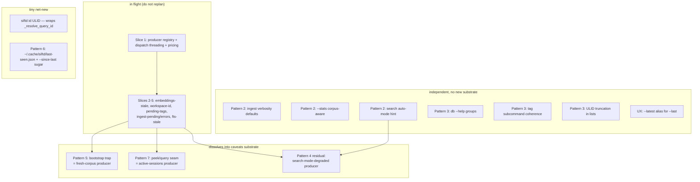
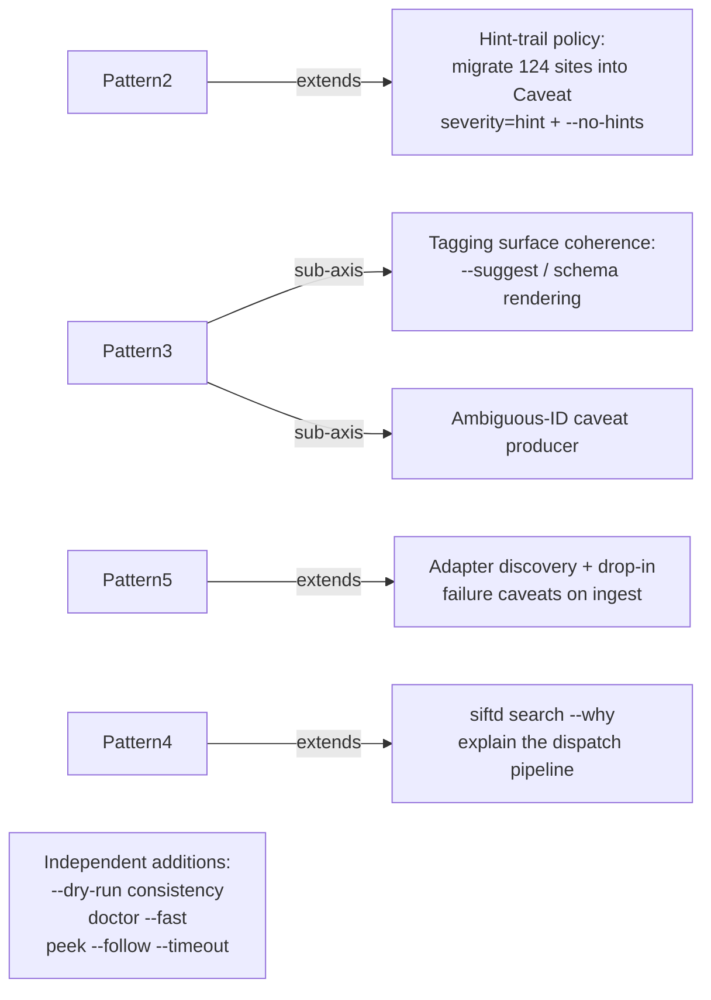

# Dogfood remediation — strategic plan (patterns 2, 3, 5, 6, 7 + UX roast)

## Context

Patterns 1 and parts of 4 are already covered by the in-flight caveats substrate
(slices 1–5: pricing, embeddings-stale, workspace-identity, pending-tags,
ingest-pending/errors, fts-stale). This plan covers the remaining patterns and
the unprefixed UX observations. The goal is a sequencing strategy and a
dissolution analysis — implementation plans come per-slice later.

The driving question for each item: **what dissolves into existing primitives,
what is genuinely net-new?** Net-new is reserved for shape that the existing
primitives can't carry without distortion.

## Architectural reframe — fidelity carries the contract

**This section was rewritten after a head-to-head with the slice-1
implementer; the previous draft proposed a `RenderShape` dataclass and
an "S1' retrofit" critical path, both of which failed the dissolution
test under audit. The diagnosis stayed; the prescription changed.**

This aligns with the user's existing `fidelity-as-contract.md` memory —
fidelity is a pipeline contract every consumer (fetch, compute, render,
caveat-produce) honors via the same depth ladder. The plan now matches
that contract instead of introducing a parallel one.

### The diagnosis (unchanged)

Caveats were initially threaded as a **dispatch concern** (producer runs
after the Operation, banner rides `render_context`) when they are
actually a **render concern** (the cell that's lying needs to stop
lying). The pricing slice exposed it: at default depth the cost column
renders, the producer doesn't fire (gated on `depth >= 3`), and the
`$0.0000` lie persists. A banner at the top can't bind to any specific
cell, so the default rendering still misleads.

Two tiers of caveats fall out:

- **Cell-tier**: column nullness — the `?` glyph in a cost cell *is* the
  caveat at column granularity. Bound to a specific row+field.
- **Op-tier**: cross-cutting answer-quality — corpus context, freshness,
  ranking degradation. Not bound to any row.

These tiers are captured implicitly by `Caveat.target`: row-id present
→ cell-tier, `None` → op-tier. No new producer subtype needed.

### The prescription (revised)

**`Fidelity` already carries the render contract; extend it, don't
parallel it.** Painted's `Fidelity(depth, visible, chars)` is in use
throughout siftd. `depth` is the field-bundle axis in disguise:

```python
# markdown_fmt.py:113-116, mirrored in html_fmt.py and painted_bridge.py
headers = ["ID", "Started", "Workspace"]
if depth >= 1: headers += ["Model", "Turns", "Tokens", "Cost"]
if depth >= 3: headers.append("Tags")
```

Producers and renderers gate on the same `fidelity.depth` ladder. When
the column shows, the producer fires; when the column doesn't show,
the producer doesn't fire. The two halves of the contract align by
sharing the primitive — that's not a workaround, it's the correct
pattern.

### Dissolution test (head-to-head)

| | RenderShape (previous draft) | Fidelity-extension (current) |
|---|---|---|
| Net-new types | 1 (`RenderShape`) | 0 |
| Cross-project impact on painted | none | one optional `fields` axis (or local subclass shim) — *deferred until needed* |
| Synchronization carriers on Operation | 2 (`fidelity` + `render_shape`) | 1 (`fidelity`) |
| Renderer migration cost | rewrite all `if depth >= N` gates | none — renderers already use `fidelity.depth` |
| Pattern fit | parallel noun for "render contract" | meaning extension on the noun that already carries it |

**Verdict: 0 net-new types vs 1.** The previous draft's structural
arguments for `RenderShape` failed audit:

1. *"Field-set is structurally different from ordinal depth."* False —
   `depth` IS a field-bundle. The structural claim was illusory.
2. *"RenderShape dissolves into typed-result substrate."* Aspirational —
   typed-result doesn't exist yet, so RenderShape was net-new shape with
   deferred dissolution. Fidelity-extension is dissolution *now*.
3. The proposed `RenderShape.granularity` axis duplicated
   `Operation.render_method` ("list"/"detail"/"search"/"stats").

### Slice 1 — punch list (no architectural commit)

1. **Move `Cost` from `depth >= 1` to `depth >= 3`** in three renderers:
   `output/markdown_fmt.py:114`, `output/html_fmt.py:354`,
   `output/painted_bridge.py:712`.
2. Cell renders `?` when `cost is None` and the column is shown.
3. Pricing producer gate is `op.fidelity.depth >= 3` (matches renderer).
4. `cli/_common.py:70` unchanged — `--brief`/default/`--full` keep
   mapping to depth 0/1/3.
5. JSON envelope already shipped per slice 1 — caveats array carries.

That's the entire change relative to slice 1 as built. No new
dataclass, no new field on `Operation`, no noun decision.

### Break-glass criterion for revisiting the noun

The noun decision returns to the table when **a producer or renderer
needs column-level granularity that depth-bundles can't express** —
e.g. "show cost without tags at default depth", or "include a
`rank_breakdown` field only when `--why` is set." When that case
arises:

- Preferred path: add `fields: frozenset[str] | None = None` to
  `Fidelity` (siftd-local subclass shim if painted upstream declines).
  Producers gate on `fidelity.fields` when set, fall back to
  `fidelity.depth` otherwise.
- Avoided path: a parallel `RenderShape` dataclass on `Operation`.

Until that case is concrete, the punt is principled, not an
oversight. Slices 1–5 do not require it. Wave B producers do not
require it. `--why` (Wave C2) likely triggers it; revisit then.

### Caveat type — additions (independent of the noun decision)

```python
@dataclass
class Caveat:
    severity: Literal["error", "warn", "info", "hint"]   # +"hint"
    message: str
    fix_command: str | None = None
    target: str | None = None        # already present (row-id, cell-tier marker)
    field: str | None = None         # new: column name for cell-tier caveats
    channel: Literal["text", "json", "both"] = "both"   # new
```

`field` lets cell-tier caveats name their column ("cost: ? in 3 of 10
rows") so the aggregator can collapse by `(name, field)`. `channel`
lets the hint migration distinguish tty-only nudges from substrate
caveats without falling back to printf. Both fields are additive and
work identically under either noun choice.

## Existing primitives (verified in code)

- **Operation IR** — `api/dispatch.py:21` `Operation` dataclass with
  `render_context: dict[str, Any]` already wired through `render(...)`. Anything
  computed at dispatch time can ride render_context to the formatter without
  new types.
- **Finding** — `doctor/checks/__init__.py:13`. Severity, message, fix_command,
  free-form `context: dict | None`. 20 producers in `BUILTIN_CHECKS`.
- **Caveats producer registry** (in flight) — substrate that runs producers on
  each Operation, surfaces results through render_context.
- **OutputFormat protocol** — `output/format_registry.py:25` with
  `render_detail/list/search`. Built-ins + drop-ins + entry points.
- **Stats cache** — `api/stats.py:218` `stats_cache_path()` already lives at
  `cache_dir() / "stats.json"`. Suitable storage analog for "since last time."
- **ID classifier** — `cli/query.py:185` `_resolve_query_id` already classifies
  any ULID into conversation vs event. Reusable as the kernel of `siftd id`.
- **`exclude_active`** — search.py already separates DB rows from live JSONL;
  the seam exists, it just isn't visible to the user.

## The shape



## Pattern-by-pattern dissolution

### Pattern 2 — editorial layer (ingest output, search defaults, `--stats` scope)

**Three sub-items, all dissolve.**

- **Ingest verbosity.** `cli/data.py:51` `_IngestTextRenderer` already supports
  `quiet`/`verbose`. Default for non-tty is currently the same as tty. Change
  the default for piped stdout to "summary line only" (the existing `quiet`
  branch). Net-new: zero. Risk: silent change for power users → gate behind a
  one-cycle deprecation hint.
- **`--stats` scope.** `cli/query.py:560` summarizes only the listed N
  conversations. Reuse `api/stats.py` `get_database_stats()` to compute corpus
  totals; render both ("View: 10 / 12,438 corpus | view tokens: 8.2K /
  142M corpus"). Net-new: zero — both APIs exist.
- **Search auto-mode hint.** Currently emitted via `print(...,
  file=sys.stderr)` at `cli/search.py:198`. JSON mode swallows it.
  **Dissolves into a Caveat producer** with `severity="hint"` and
  `channel="both"`. Producer gates on `op.fn.__name__ == "search_chunks"`
  and `search_mode == "fts"` (i.e. the auto-fallback fired); fires
  regardless of depth, since the auto-fallback is a property of the
  result list as a whole. Net-new: nothing — one more producer.

### Pattern 3 — storage-think in UX (naming, organization, `$ULID`, tag incoherence)

**Mix of cheap wins and tar pits.**

- **`siftd db` is twelve commands** (`cli/db.py:733`). Reorganization is the
  tar pit — every dogfood transcript and agent prompt would break.
  **Don't rename, group help.** argparse has no native group-in-help, but
  `RawDescriptionHelpFormatter` already lets us write the `epilog` with
  categories ("Inspection", "Maintenance", "Sync", "Sync remotes"). 30-min
  edit to `cli/db.py:739` epilog. Net-new: zero.
- **Tag subcommand incoherence** (`cli/tags.py:21` `_TAG_SUBCOMMANDS`).
  `siftd tag <id> <tag>` (positional) coexists with `siftd tag list <name>`
  (subcommand). Add explicit subcommand `siftd tag apply <id> <tag>` and
  `siftd tag remove <id> <tag>`; keep current parser branches as the same
  call path so the legacy form keeps working. Net-new: ~15 LOC for two
  subparsers, zero new types.
- **Three IDs** (conversation / event / session). Already classified by
  `_resolve_query_id`. **Net-new (small):** a `siftd id <ULID>` command that
  reuses that function and prints a one-line classification with hints
  ("This is a conversation in workspace X. View: `siftd query <id>`."). Files:
  one new `cli/id_cmd.py`, ~50 LOC. No new domain types.
- **`$ULID` surface in lists.** Renderers already truncate inconsistently —
  `cli/search.py:415` uses `[:12]`, others `[:8]`, others print full. Pick a
  single short form (8 chars matches the existing peek output) and apply in
  the four list/search renderers. Net-new: zero. Risk: agents that grep for
  exact-length IDs.

### Pattern 5 — bootstrap trap as discipline

**Fully dissolves into a caveat producer.**

The producer fires when the corpus is empty or one-adapter-thin (e.g.
`SELECT COUNT(*) FROM conversations < 10`). It surfaces with severity `info`,
message "Database has N conversations from M adapters; results reflect a
narrow slice", fix_command `siftd ingest`. Sketch:

```python
class FreshCorpusProducer:
    name = "fresh-corpus"
    def produce(self, op: Operation, ctx) -> list[Caveat]:
        # only relevant for query/search/tools operations
        if op.fn.__name__ not in {"list_conversations", "search_chunks",
                                   "get_tool_tag_summary"}:
            return []
        n = ctx.conn.execute("SELECT COUNT(*) FROM conversations").fetchone()[0]
        if n < 10:
            return [Caveat("info", f"corpus has {n} conversations; ...")]
        return []
```

Net-new: zero — one producer module, registered in the registry. ~40 LOC.

### Pattern 6 — time dimension ("since last time")

**Mostly dissolves; one tiny net-new file.**

- The filter machinery (`cli/_filters.py:70` `--since`) already exists and is
  threaded through every list/search command.
- What's missing is a remembered timestamp. Net-new: one file
  `~/.cache/siftd/last-seen.json` mapping `{command: ISO timestamp}`. Read on
  command entry, written on successful exit. Add a single flag `--since-last`
  that resolves to the stored timestamp before `extract_filter_args`. ~80 LOC
  total in a new `cli/_last_seen.py`.

```
+------------------+        +-----------------------+
| --since-last     | -----> | _last_seen.read(cmd)  |
+------------------+        +-----------------------+
                                       |
                                       v
                            args.since = timestamp
                                       |
                                       v
                            (existing filter pipeline)
                                       |
                            on success: write(cmd, now)
```

Risks: silently stateful → flag must be opt-in; document loudly; never
affect default behavior. Don't update the timestamp on `--dry-run` or on
non-zero exits.

### Pattern 7 — peek/query seam invisible

**Fully dissolves into a caveat producer.**

When `cmd_query` runs with a workspace filter (or no filter), check
`peek.list_active_sessions(workspace=...)` for sessions that match the
operation's filters but aren't in the result set. Producer fires with
"+N active sessions in <workspace> not yet ingested
(siftd peek -w <workspace>)". Half of this is already a printf hint at
`cli/query.py:535` — promote it to a structured Caveat so JSON mode also
carries it.

Net-new: one producer in the registry, ~50 LOC. No new types.

## Slice sequencing

```mermaid
gantt
    title Sequencing relative to in-flight caveats slices 1–5
    dateFormat X
    axisFormat %s

    section In flight
    S1 substrate + cost@depth>=3      :s1, 0, 1
    S2-S5 producers                   :s2, after s1, 3

    section Wave A (independent of caveats)
    A1 ingest verbosity defaults     :a1, 0, 1
    A2 --stats corpus-aware           :a2, 0, 1
    A3 db --help groups               :a3, 0, 1
    A4 ULID truncation in lists       :a4, 0, 1
    A5 --latest alias                 :a5, 0, 1
    A6 tag apply/remove subcmds       :a6, 0, 1
    A7 siftd id ULID                  :a7, 0, 2

    section Wave B (after S1 lands)
    B1 search-mode-degraded producer  :b1, after s1, 1
    B2 fresh-corpus producer          :b2, after s1, 1
    B3 active-sessions producer       :b3, after s1, 2
    B4 ambiguous-id producer          :b4, after s1, 1
    B5 adapter-health on ingest       :b5, after s1, 1

    section Wave H (prove inline, then sweep)
    H1 Caveat severity=hint + channel :h1, after s1, 1
    H2 --no-hints flag                :h2, after h1, 1
    H3 5-8 inline migrations in S2-S4 :h3, after h2, 3
    H4 Haiku Subtask sweep (>50 sites):h4, after h3, 2

    section Wave C (independent, last)
    C1 last-seen sugar (--since-last) :c1, 0, 2
    C2 --why search shape             :c2, after s1, 1
```



**Dependency rules:**

- **S1 ships as built**, plus the Cost-column move from `depth >= 1`
  to `depth >= 3` in the three renderers. No retrofit, no new types.
- Wave A is shippable today in any order, parallel to S1.
- Wave B requires S1. B1, B4, B5 are new since the original plan.
- **Wave H is prove-then-sweep**, not lockstep:
  - H1+H2 land the substrate (`severity="hint"`, `channel`,
    `--no-hints`).
  - H3 migrates 5–8 printf sites by hand during S2–S4, opportunistically
    where each slice's command surface overlaps with hint sites. Goal:
    lock the conversion recipe.
  - H4 is one Haiku Subtask in a worktree, triggered when the recipe is
    proven and >50 sites remain. Conversion is mechanical (~5 LOC per
    site); routes per the user's delegation memory (3+ files of
    mechanical churn → Subtask, not inline). Output: ~30 sites per PR
    for reviewability.
- Wave C: C1 unchanged. C2 (`--why`) likely triggers the
  `Fidelity.fields` break-glass criterion — revisit then, not now.

## Sketches of the genuinely net-new pieces

### `cli/id_cmd.py` — three-IDs disambiguator

Single command, no flags beyond `--json`. Reuses `_resolve_query_id`. Output:

```
$ siftd id 01HX4G7K9...
conversation 01HX4G7K9... (workspace: ~/code/siftd, started 2026-05-01)
view:  siftd query 01HX4G7K9...
```

### `~/.cache/siftd/last-seen.json` — since-last storage

```json
{
  "search": "2026-05-08T14:30:00Z",
  "query":  "2026-05-08T14:32:11Z"
}
```

API surface: two functions in `cli/_last_seen.py`:

```python
def read(cmd: str) -> datetime | None: ...
def write(cmd: str, ts: datetime) -> None: ...
```

Wired into `cmd_query`/`cmd_search`/`cmd_tools` only — opt-in per command.

### Caveat producers (Wave B) — three new ~50-LOC modules

Each follows the shape from the in-flight S2 slices: name, `produce(op, ctx)
-> list[Caveat]`, registered alongside the existing producers. No new types.

## Risks (tar pits vs cheap wins)

**Tar pits — avoid:**

- **Renaming `siftd db` subcommands** or hoisting them to top-level. Breaks
  every transcript, agent prompt, README example. Help-grouping gives 80% of
  the legibility benefit for 5% of the cost.
- **Renaming `--last`** across export/peek/tag. Three meanings, but each is
  consistent within its command and `--last-X` already disambiguates by
  scope. Add `--latest` as an alias where it helps; do not deprecate `--last`.
- **Caveat noise.** Wave B + Wave H combined could push 4-5 caveats per
  output. The in-flight substrate must cap caveat count and support
  `--no-caveats`/`--no-hints`; verify before B1–B5 land. Consider a
  per-severity cap (max 1 hint per banner; warns/errors uncapped).
- **Magical state from `--since-last`.** Surprising for agents that don't
  know the file exists. Make it explicit (flag-only, never default), and
  document at `siftd query --help`.
- **Cell-tier caveats without aggregation.** If 30 rows have missing
  cost, the banner should say "cost missing in 30 rows", not emit 30
  caveats. The aggregation rule is: cell-tier caveats with the same
  `(name, field)` collapse into one entry with a count.

**Cheap wins (≤2 hr each):**

- A3 db --help groups
- A4 ULID truncation consistency
- A5 `--latest` alias
- A7 `siftd id`
- B2 fresh-corpus producer
- B3 active-sessions producer

**Medium (half day each):**

- A1 ingest verbosity default change (needs a deprecation hint)
- A2 `--stats` corpus mode
- A6 tag apply/remove subcommands (needs to keep legacy positional working)
- C1 last-seen sugar

## Overlaps to flag with the typed-result substrate

The typed-result substrate (next architectural piece per ROADMAP) will
formalize what the formatters receive. The plan above intentionally
defers the column-level granularity question to that work, via the
break-glass criterion: when a producer or renderer needs field-level
selectivity that depth-bundles can't express, the answer is to extend
`Fidelity` (preferred) or shape the typed-result variant — both cheaper
than introducing a parallel noun now.

Two items here brush that boundary but don't force it:

- **A2 `--stats` corpus mode** synthesizes a derived view of the result
  list. Lands as a depth-conditional renderer block today; promotes
  cleanly to a `StatsView` typed-result variant later.
- **B3 active-sessions producer** computes a sibling count off the
  result. Gates on `op.fn.__name__ == "list_conversations"` and depth;
  no field-level selectivity needed, no churn under typed-result.

Don't preempt the typed-result design. The Fidelity-extension path
keeps the door open without prepaying.

## Surfaced from exploration — additional opportunities

These pulled at me as I read through the code. Some belong in the existing
patterns as sub-axes; some are genuinely separate concerns the original
dogfood notes didn't enumerate.

### Hint-trail policy is a real substrate concern (extends Pattern 2)

`grep "Tip:|file=sys.stderr" cli/*.py` returns **124 sites**. There's no
shared policy for any of:

- tty-only vs piped-too (some hints fire only on tty, some always)
- `--json` carries vs silently drops (most drop)
- first-time-only vs every-run (none are first-time-gated)
- severity (all are flat printf)

Examples within a few hundred lines: `cli/query.py:535` (peek hint),
`cli/query.py:543` (ingest hint), `cli/search.py:198` (FTS5 mode),
`cli/search.py:200` (install embed), `cli/search.py:336` (privacy warning),
`cli/search.py:416` and `:563` (duplicate tagging hints with different ULID
truncation), `cli/data.py:342` ("use --json" — fires for any non-tty).

**Strategic call:** treat the hint trail as the *bigger* form of Pattern 2.
With `severity="hint"` and `channel: "text" | "json" | "both"` added to
the Caveat type, the 124 sites migrate cleanly. Each becomes a producer
with an `applies_to` predicate that mirrors the original print's
conditional: a hint about "use peek for live activity" gates on the
result list being non-empty in a workspace with active sessions; a hint
about `--json` gates on the formatter being text-table.

**Dissolution:** the two new Caveat fields (`severity="hint"`,
`channel`), one suppression flag (`--no-hints`), and a migration backlog
of ~124 sites — most are ~5 LOC per site once the recipe is locked.

**Sequencing (prove-then-sweep, not lockstep):** ship the substrate
fields with S1+S2; migrate 5–8 printf sites by hand during S2–S4 to
prove the recipe; then route the remaining 100+ sites to a Haiku
Subtask sweep in a worktree (per the user's delegation memory: 3+ files
of mechanical churn → Subtask, not inline). Don't try to migrate all
124 sites lockstep with each slice — that conflated proving-the-pattern
with bulk-migration in the previous draft.

### Tagging surface coherence (sub-axis of Pattern 3)

Two parallel tagging models that an agent has to choose between:

- `siftd tag <id> <name>` — direct, requires the conversation to be
  ingested (`cli/tags.py`)
- `siftd tag --session <id> --last-response <name>` — pending, applies on
  next ingest, targets *parts* of a live session (`cli/tags.py:82`)

The second is far richer (supports `--exchange N`, `--last-prompt`,
`--last-response`, `--last-tool_call`, `--last-exchange`) but is invisible
unless you read `--help` carefully. Plus the suggested namespace
(`research:<topic>`) is invented on the fly in hints and never validated.

**Strategic call:** small additions, not a redesign:

- `siftd tag list --suggest` (or extend the existing list command) showing
  the namespaces actually in use — agents stop inventing.
- `siftd tag schema` showing both surfaces so the choice is explicit.
- **Net-new: zero — existing `list_tags` already returns namespace
  prefixes.** Just a `--prefixes-only` rendering.

### Ambiguous-ID Caveat (extends Pattern 3 / Pattern 4)

`cli/query.py:185` `_resolve_query_id` silently prefers conversations when
both branches resolve. The comment notes "rare, since ULIDs are globally
unique — but cheap to enforce." For prefix matches it's no longer rare.

**Dissolution:** caveat producer that fires when the ID prefix matched
multiple kinds. ~30 LOC. Belongs in Wave B.

### Adapter health on ingest (extends Pattern 5 — bootstrap trap)

`siftd ingest` runs every adapter every time and reports per-adapter
counts in `_IngestTextRenderer`, but two important silences remain:

- **Discovery-zero:** "I ran 8 adapters, 7 found nothing" prints as a row
  of zeros buried in the table. For a bootstrapping user, this should
  surface as "only `claude_code` is producing output; do you have logs
  for the others?" — caveat-style.
- **Drop-in failures:** if `~/.config/siftd/adapters/foo.py` raises on
  import, `plugin_discovery.load_all_extensions` swallows it (or stack-
  traces, depending on validation). An agent can't tell whether the file
  is broken or just dormant.

**Dissolution:** adapter-status caveats from the existing `validate_*`
hook in `plugin_discovery.py`. ~50 LOC. Belongs in Wave B.

### `siftd why` / search-pipeline explainer (extends Pattern 4)

The score breakdown at `cli/search.py:651` is buried in
`--json | jq '.results[0].breakdown'`. When an agent can't tell why a
relevant conversation didn't surface, the dispatch path is opaque.

**Dissolution:** `--why` is the **break-glass case** for the
`Fidelity.fields` extension. Today's depth-bundles can't express
"include `breakdown` field at default depth without dragging in the
full bundle." When C2 is implemented, the right move is to add
`fields: frozenset[str] | None = None` to `Fidelity` (siftd-local
subclass shim if painted upstream declines), set `fields={"breakdown",
"resolved_pipeline"}` when `--why` is passed, and gate the renderer
block on `"breakdown" in (op.fidelity.fields or set())`. ~40 LOC plus
the one-line subclass shim.

This pairs naturally with C1 (since-last) — both are "make the implicit
explicit" sugar over existing primitives. C2 is the planned
revisit-the-noun moment; until then, the punt holds.

### Long-running-op `--dry-run` consistency (cheap; partly safety)

`grep dry-run cli/*.py`: covered for `migrate`, `slice`, `merge`, `push`,
`pull`, `backfill --filter-binary`, `install`. Missing for `ingest`,
`vacuum`, `restore`, `search --rebuild`, `db process`, `db receive`. Of
those, **`restore` and `db receive` are destructive without a preview** —
that's a safety bug, not just a dogfood pain. Worth a separate slice
distinct from this strategy doc.

### Doctor cost-tier exposure (cheap)

`Check.cost: Literal["fast", "slow", "deep"]` (`doctor/checks/__init__.py:10`)
already exists; `--deep` is exposed. There's no `--fast` to skip slow
checks for an "agent-running-doctor-pre-task" workflow. One flag,
already-classified checks. ~10 LOC.

### `siftd peek --follow` has no timeout (cheap; agent-pain)

An agent that calls `peek --follow` for "any activity?" hangs until the
session ends. Add `--timeout N` (seconds). ~15 LOC; the follow loop in
`peek/follow.py` is the only edit.

## Re-summarising the additions



## Verification (per-slice; expanded in implementation plans)

- **S1 cost-column move:**
  - Unit test: cell renderer emits `?` for `None` cost when column is
    shown (depth ≥ 3), no flag required.
  - Integration test: `siftd query --full` against a fixture DB with one
    row missing pricing → text output shows `?` in cost column AND a
    banner note `cost missing in 1 row`; `--json` carries the same caveat
    in structured form.
  - Integration test: `siftd query` (default depth=1) against the same
    fixture → cost column absent, missing-pricing producer doesn't fire,
    no banner. `siftd query --brief` (depth=0) likewise.
  - (Field-level fetch optimization — "don't even query cost at lower
    depth" — deferred to typed-result substrate per the break-glass
    criterion. Not in scope for slice 1.)
- **Caveat producers (Wave B):** unit tests covering
  produce-when-relevant and produce-nothing-otherwise (gating on
  `op.fn.__name__` and `op.fidelity.depth`); integration test that
  runs `siftd query` / `siftd search` against a fixture DB and asserts
  the caveat appears in text and JSON outputs.
- **Hints migration (Wave H):** for each migrated site, snapshot test of
  text output (hint present), JSON output (hint present in `caveats[]`
  with `severity="hint"`), and `--no-hints` (hint absent in both).
  H4 sweep PRs include diff-only assertions: each removed printf maps
  to one new producer registration with a matching `applies_to` predicate.
- **`siftd id` (A7):** integration test using existing event/conversation
  fixtures asserting classification and exit codes.
- **`--since-last` (C1):** integration test that creates the cache file,
  runs a search, verifies the cache updates; second run filters to the
  delta. Confirm `--dry-run` doesn't touch the cache.
- **Editorial defaults (A1, A2):** snapshot tests of stdout for piped vs
  tty; assertion that `--stats` shows "X / Y corpus".
- **Help groups, ULID truncation, alias:** snapshot tests of `--help` output
  and list rendering; one CHANGELOG note for `--latest`.
